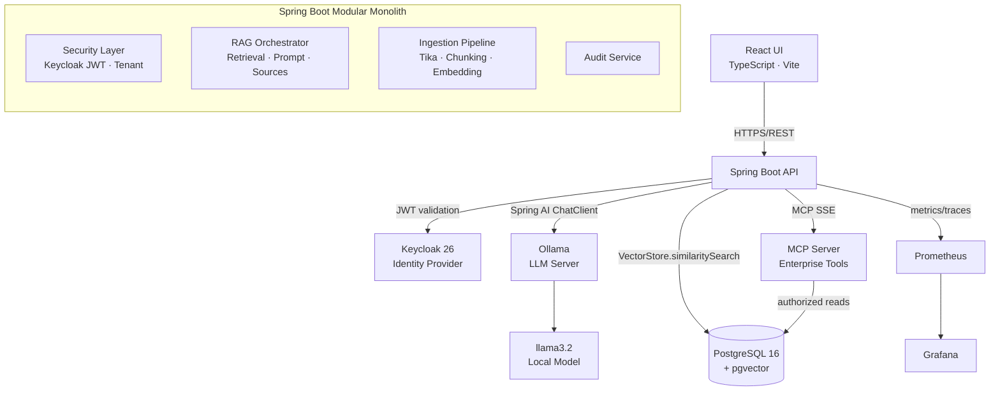

# Architecture

## System Overview



## Module Structure

```
com.enterprise.rag
├── api                  REST controllers, DTOs, error handling
├── security             JWT converter, tenant context, authorization
├── rag
│   ├── ingestion        Tika extraction, text normalization
│   ├── chunking         Sliding-window token chunker
│   ├── retrieval        Authorization-aware vector search
│   ├── orchestration    Full RAG pipeline coordinator
│   └── prompt           Prompt templates, injection sanitizer
├── ai
│   ├── chat             ChatClient configuration
│   └── embedding        EmbeddingModel wrapper
├── mcp
│   └── tools            4 MCP tools + Spring AI tool registration
├── document             Document entity, repo, service, controller
├── conversation         Conversation + Message entities
├── audit                AuditEvent entity + async audit service
├── observability        Micrometer custom metrics
└── configuration        AppProperties, WebConfig, AsyncConfig
```

## Key Design Decisions

| Decision | Rationale |
|----------|-----------|
| Modular monolith | Start simple; each module has clear boundaries for future extraction |
| Spring AI abstractions | `ChatClient`, `VectorStore`, `EmbeddingModel` — never Ollama-specific APIs in business logic |
| Flyway migrations | Production-safe schema management; no DDL auto |
| Async ingestion | `@Async` with dedicated thread pool keeps uploads non-blocking |
| Separate audit transaction | `REQUIRES_NEW` ensures audit record is never rolled back with business transaction |
| Localhost binding | All ports on `127.0.0.1` — no unintended external exposure |
