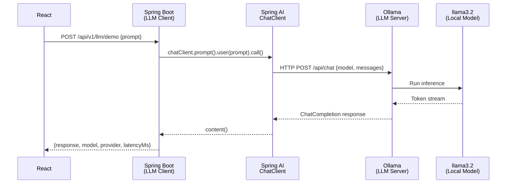

# LLM Client / Server Architecture

## Concept

> **Spring AI application = LLM Client**
> **Ollama = LLM Server**
> **llama3.2 = Local Model (inference engine)**

The model is never embedded inside the Spring Boot process. It runs as a separate server process (Ollama) and is accessed over HTTP.

## Architecture



## Configuration

```yaml
spring:
  ai:
    ollama:
      base-url: ${OLLAMA_BASE_URL:http://localhost:11434}
      chat:
        model: ${LLM_MODEL:llama3.2}
      embedding:
        model: ${EMBEDDING_MODEL:nomic-embed-text}
```

## Model Abstraction

Business logic **never** depends on `OllamaChatModel` directly. It depends on:
- `ChatClient` — the Spring AI abstraction for chat
- `EmbeddingModel` — the Spring AI abstraction for embeddings
- `VectorStore` — the Spring AI abstraction for vector search

Switching from Ollama to another provider requires only a configuration change — no code changes in business logic.

## Starting Ollama

```bash
# Start Ollama server (or use Docker Compose)
ollama serve

# Pull required models
ollama pull llama3.2
ollama pull nomic-embed-text

# Verify
curl http://localhost:11434/api/tags
```
