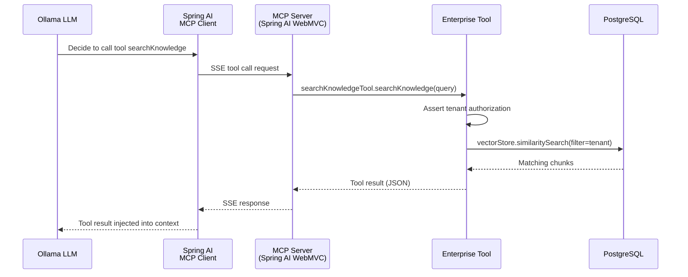

# MCP Architecture

## What is MCP?

The **Model Context Protocol** answers:
> "How can the AI application access standardized tools and resources?"

MCP is NOT a replacement for RAG. The distinction:

| Concept | Purpose |
|---------|---------|
| RAG | Retrieve relevant knowledge from the vector store |
| MCP | Access live tools/resources in a standardized way |
| LLM | Transform retrieved information into a response |
| Vector DB | Where knowledge can be searched |

## Architecture

## Tools Exposed

| Tool | Description | Authorization |
|------|-------------|---------------|
| `searchKnowledge` | Semantic search over tenant's knowledge base | Tenant-scoped |
| `getDocumentMetadata` | Returns document metadata by ID | Tenant-scoped |
| `getDocumentById` | Returns full document content | Tenant-scoped |
| `getPolicyInformation` | Finds policy docs by keyword | Tenant-scoped |

All tools are **read-only** in the MVP. State-changing tools would require additional confirmation.

## Security

Every tool call:
1. Requires authenticated JWT
2. Checks tenant boundary via `RagAuthorizationService`
3. Is logged to `AuditEvent` table
4. Uses parameterized queries (no injection possible)
5. Returns safe error messages (no stack traces)

## Transport

The MCP server uses SSE (Server-Sent Events) transport via the `spring-ai-starter-mcp-server-webmvc` starter. The client connects at `/mcp/sse`.
