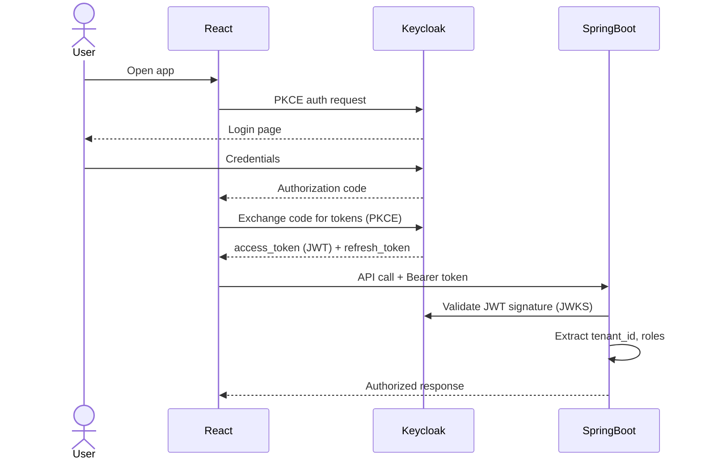

# Security Architecture

## Authentication Flow



## JWT Claims

```json
{
  "sub": "uuid-of-user",
  "email": "user@acme.com",
  "tenant_id": "acme",
  "realm_access": {
    "roles": ["USER", "UPLOADER"]
  }
}
```

## Tenant Isolation

1. `TenantContextFilter` extracts `tenant_id` from JWT into `TenantContext` (ThreadLocal)
2. `MetadataFilterBuilder` builds PGVector filter: `tenant_id = 'acme' AND status = 'INDEXED'`
3. All vector similarity searches include this mandatory filter
4. Document retrieval uses `findByIdAndTenantId` — cross-tenant access is impossible

**A user from Tenant A can never see Tenant B documents, even if they are semantically similar.**

## Role-Based Access Control

| Role | Permissions |
|------|-------------|
| `ADMIN` | All operations including actuator |
| `UPLOADER` | Upload and delete documents |
| `USER` | Query RAG, list documents |

## Prompt Injection Defense

Documents may contain adversarial text. Defenses:
1. System prompt instructs the model to treat context as untrusted data
2. System prompt explicitly forbids following instructions in context
3. `PromptSanitizer` strips control characters and logs injection pattern warnings
4. Response content is returned as-is — never executed

## Secrets Management

- All secrets via environment variables
- `.env` file is in `.gitignore` — never committed
- Production: use a secrets manager (HashiCorp Vault, IBM Key Protect)

## Logging Security

- Stack traces: logged server-side only, never sent to clients
- Sensitive content (prompts, answers): NOT stored in audit table
- Only safe metadata stored: IDs, model name, latency, status
